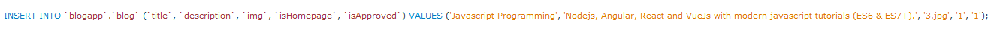

# Blog App

## Requirement

npm --version

## Project

npm init --yes

npm i express@4.18.1

npm i nodemon@2.0.19 --save-dev //gelistirme de yardimci

npm i bootstrap@5.2.0

npm i ejs@3.1.8

EJS language support //Extension

npm i mysql2@2.3.3

## RUN

n̶o̶d̶e̶ ̶i̶n̶d̶e̶x̶.̶j̶s̶

̶n̶p̶x̶ ̶n̶o̶d̶e̶m̶o̶n̶

npm start

## DATABASE

BLOG

Create Table

Insert Data

CATEGORY

Create Table

Insert Data

Alter Table

Add categoryId

